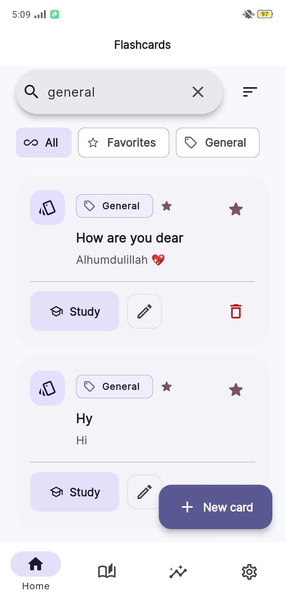
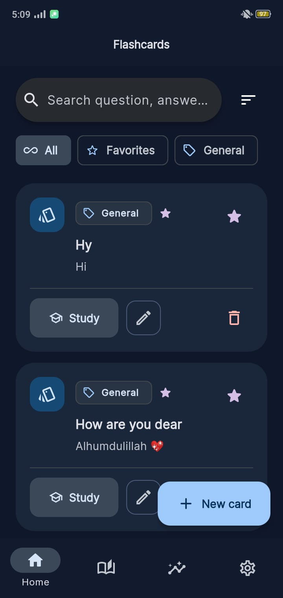
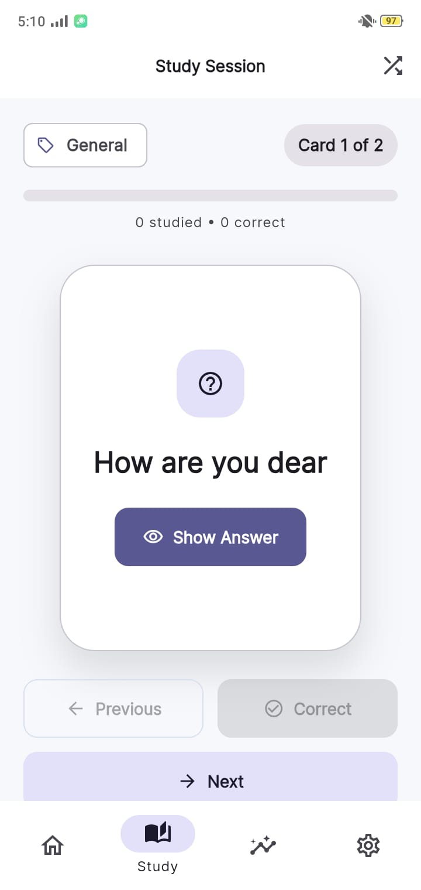
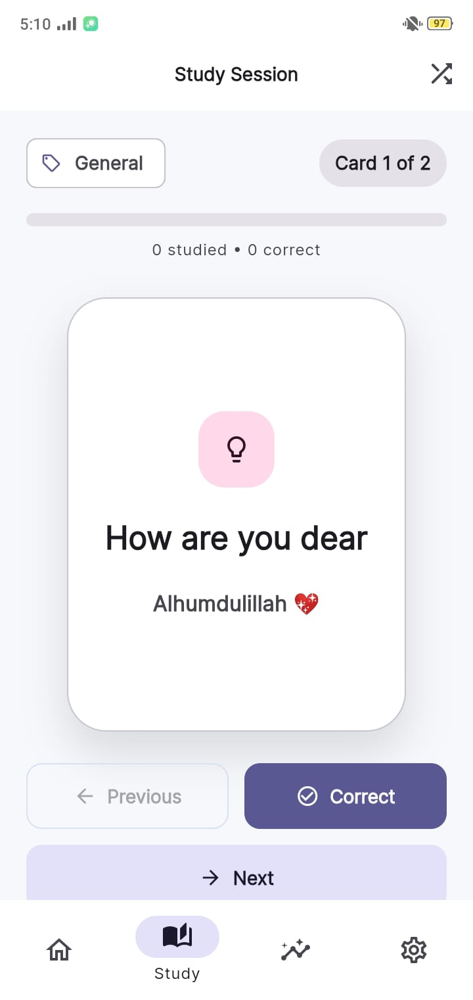
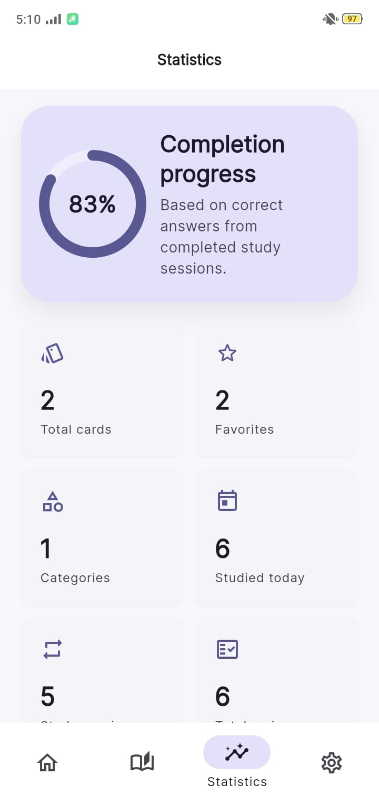
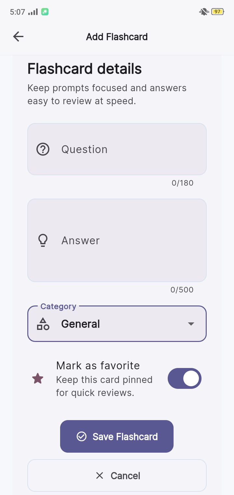
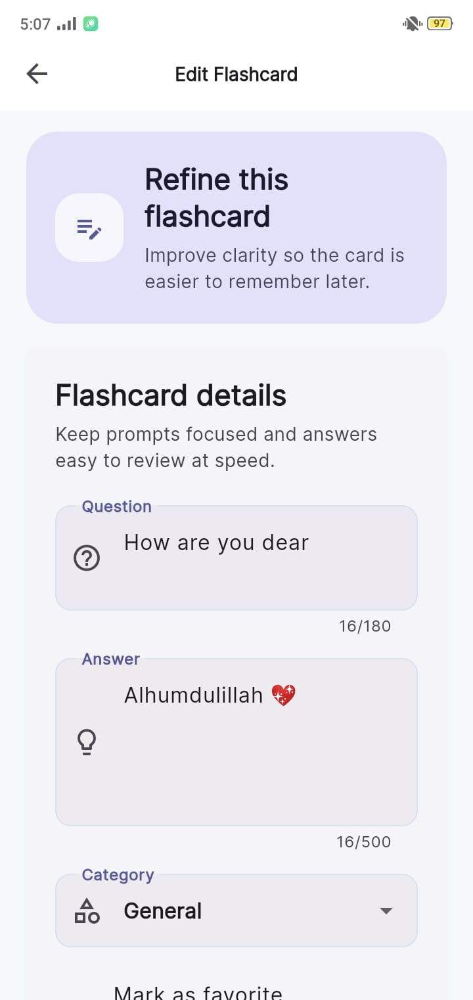
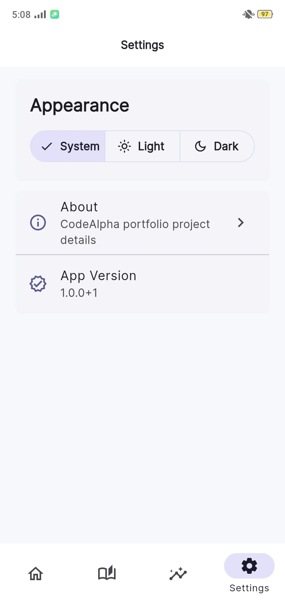
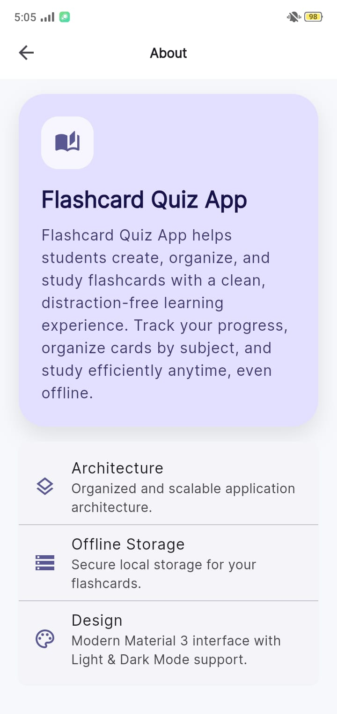

# Flashcard Quiz App

    

A modern offline-first Flutter flashcard learning app designed for students who want a clean, focused, and productive study experience with a premium Material 3 interface.

## 📱 Project Preview

Flashcard Quiz App is a student-friendly mobile application that helps users create, organize, and study flashcards with ease. It provides a polished experience for revision, progress tracking, and structured learning, all while working smoothly offline.

## ✨ Features

- ✔ Create Flashcards
- ✔ Edit Flashcards
- ✔ Delete Flashcards
- ✔ Study Flashcards
- ✔ Shuffle Mode
- ✔ Categories
- ✔ Favorites
- ✔ Search
- ✔ Filters
- ✔ Statistics Dashboard
- ✔ Study Progress
- ✔ Material 3
- ✔ Light Theme
- ✔ Dark Theme
- ✔ Riverpod
- ✔ Drift Database
- ✔ SQLite
- ✔ Responsive UI
- ✔ Offline Support
- ✔ Premium Modern Design

## 📸 Screenshots

| Home (Light) | Home (Dark) |
| ---- | ---- |
|  |  |

| Study Question | Study Answer |
| ---- | ---- |
|  |  |

| Statistics | Search & Filters |
| ---- | ---- |
|  |  |

| Add Flashcard | Edit Flashcard |
| ---- | ---- |
|  |  |

| Settings | About |
| ---- | ---- |
|  |  |

## 🏗 Architecture

The app follows a Clean Architecture approach with a clear separation of responsibilities across the Presentation, Domain, and Data layers. Reusable widgets and local persistence are organized to keep the codebase scalable, readable, and maintainable.

## 📂 Folder Structure

```text
lib/
  app/
  core/
  features/
  shared/

assets/
  screenshots/
  icons/
  images/
```

## 🛠 Tech Stack

| Technology | Purpose |
| ---------- | ------- |
| Flutter | Cross-platform mobile app development |
| Dart | Application programming language |
| Riverpod | State management |
| GoRouter | Navigation and routing |
| Drift | Local database layer |
| SQLite | Persistent offline storage |
| Material 3 | Modern UI design system |
| Google Fonts | Typography |

## 📦 Packages Used

- flutter_riverpod
- go_router
- drift
- drift_flutter
- sqlite3_flutter_libs
- path_provider
- path
- google_fonts
- equatable

## 🚀 Getting Started

### Requirements

- Flutter Stable
- Dart SDK
- Android Studio
- VS Code

### Installation

```bash
git clone https://github.com/mairasarwar132/CodeAlpha_FlashcardQuizApp.git
cd CodeAlpha_FlashcardQuizApp
flutter pub get
flutter run
```

## 🎯 Project Highlights

This project stands out for its combination of:

- Clean Architecture
- Offline First experience
- Modern Material 3 UI
- Student Friendly workflow
- Fast Performance
- Responsive Design
- Easy Navigation

## 🌙 Theme Support

The app supports Light Mode, Dark Mode, and System Theme settings, giving users a comfortable study experience in any environment.

## 📈 Future Improvements

- Cloud Sync
- Firebase Authentication
- Spaced Repetition Algorithm
- Quiz Mode
- Notifications
- Backup & Restore

## 👨‍💻 Author

Maira Sarwar

BS Information Technology

Flutter Developer

GitHub: [Maira Sarwar](https://github.com/mairasarwar132)

## 🔗 Repository

GitHub Repository:

[CodeAlpha_FlashcardQuizApp](https://github.com/mairasarwar132/CodeAlpha_FlashcardQuizApp)

## 🎓 Internship

This project was developed as part of the CodeAlpha Flutter Development Internship.

## 📄 License

This project is licensed under the MIT License.

## ⭐ Support

If you found this project useful, consider giving it a ⭐ on GitHub.
